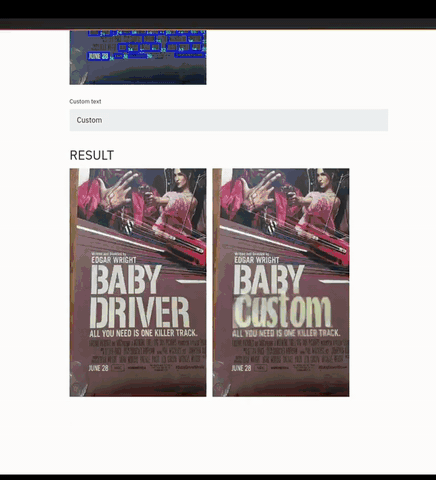

# SRNet

This repository presents SRNet ([Liang Wu et al](https://arxiv.org/pdf/1908.03047.pdf)), a neural network that tackles the problem of text editing in images. It marks the inception of an area of research that could automate advanced editing mechanisms in the future. 


SRNet is a twin discriminator generative adversarial network that can edit text in any image while maintaining context of the background, font style and color. The demo below showcases one such use case. Movie poster editing.



----
### Architecture changes

This implementation of SRNet introduces two main changes. 

1. **Training**: The original SRNet suffers from instability. The generator loss belies the instability that occurs during training. This imbalance affects skeleton (t_sk) generation the maximum. The effect manifests when the generator produces a sequence of *bad* t_sk generations, however instead of bouncing back, it grows worse and finally leads to mode collapse. The culprit here is the min-max loss. A textbook method to solve this problem is to let the discriminator always be ahead of the generator. The same was employed in this implementation.


2. **Generator**: In order to accomodate for a design constraint in the original net, I have added three extra convolution layers in the *decoder_net*.

Incorporating these changes improved t_sk generations dramatically and increased stability. However, this also increased training time by ~15%. 

----
## Usage

A virtual environment is the most convenient way to setup the model for training or inference. You can use *virtualenv* for this. The rest of this guide assumes that you are in one.

- Clone this repository:
    ```bash
    $ git clone https://github.com/Niwhskal/SRNet.git

    $ cd SRNet
    ```
- Install requirements (Make sure you are on python3.xx):
    ```bash
    $ pip3 install -r requirements.txt
    ```
### Data setup

This repository provides you with a bash script that circumvents the process of synthesizing the data manually as the original implementation does. The default [configuration parameters](https://github.com/Niwhskal/SRNet/blob/582749370e356cb32396152f6078e1150b91212e/SRNet-Datagen/Synthtext/data_cfg.py#L10) set's up a dataset that is sufficient to train a robust model.

- Grant execute permission to the bash script:
    ```bash
    $ chmod +x data_script.sh
    ```
- Setup training data by executing:
    ```bash
    $ ./data_script.sh
    ```
The bash script downloads background data and a word list, it then runs a datagenerator script that synthesizes training data. Finally, it modifies paths to enable straightforward training. A detailed description of data synthesis is provided by [youdao-ai](https://github.com/youdao-ai/SRNet-Datagen) in his original datagenerator repository. 

If you wish to synthesize data with different fonts, you could do so easily by adding custom *.ttf* files to the fonts directory before running `datagen.py`. Examine the flow of `data_script.sh` and change it accordingly.

### Training

- Once data is setup, you can immediately begin training:
    ```bash
    $ python3 train.py
    ```
If you wish to resume training or use a checkpoint, update it's [path](https://github.com/Niwhskal/SRNet/blob/9f7b34d4bdffa3951912ac739c22997a66a1ad0a/cfg.py#L24) and run `train.py`

If you are interested in experimenting, modify hyperparameters accordingly in `cfg.py`

### Prediction

In order to predict, you will need to provide a pair of inputs (The source *i_s* and the custom text rendered on a plain background in grayscale (i_t) -examples can be found in `SRNet/custom_feed/labels`-). Place all such pairs in a folder.  

- Inference can be carried out by running:
    ```bash
    $ python3 predict.py --input_dir *data_dir* --save_dir *destination_dir* --checkpoint *path_to_ckpt*
    ```
Pre-trained weights will be uploaded soon.

## Demo

Code for the demo is hastily written and is quite slow. If anyone is interested in trying it out or would like to contribute to it, open an issue, submit a pull request or send me an email at `lakshwin045@gmail.com`. I can host it for you. 

## References

* [Editing Text in the Wild](https://arxiv.org/abs/1908.03047): An innovative idea of using GAN's in an unorthodox manner. 

* [Youdao-ai's original repository](https://github.com/youdao-ai/SRNet): The original tensorflow implementation which helped me understand the paper from a different perspective. Also, credit to youdao for the [data synthesis code](https://github.com/youdao-ai/SRNet-Datagen). If anyone is interested in understanding the way data is synthesized for training, examine his repository.

* [SynthText project](https://github.com/ankush-me/SynthText): This work provides the background dataset that is instrumental for data synthesis.

* [Streamlit docs](https://www.streamlit.io/): One of the best libraries to build and publish apps. Severely underrated.
